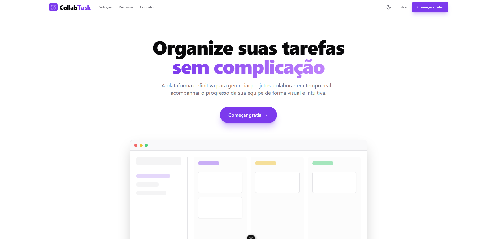
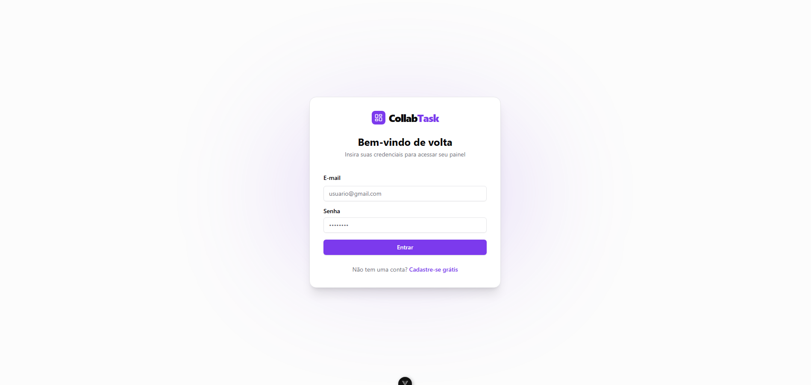
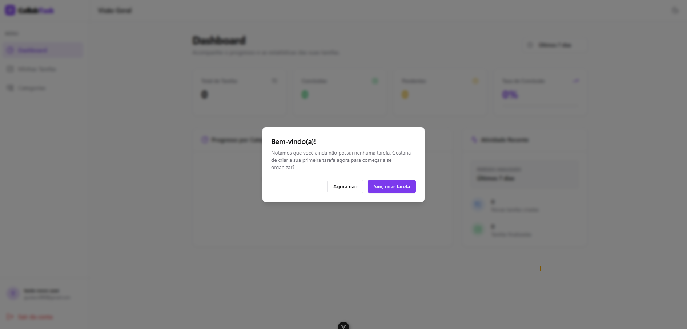
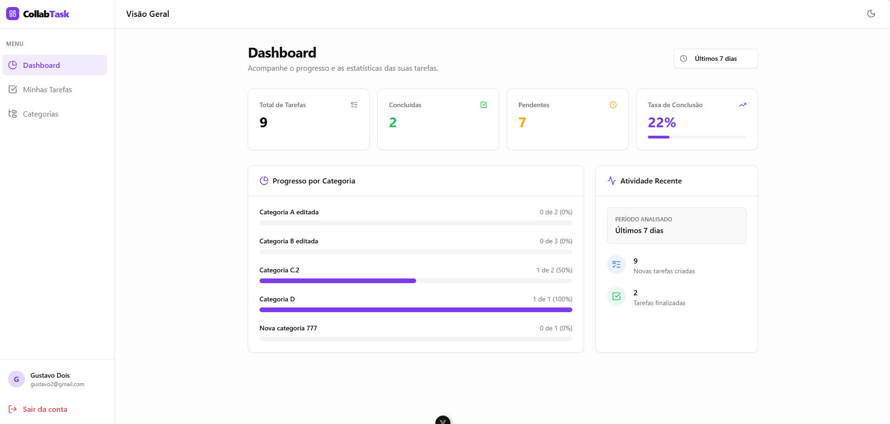
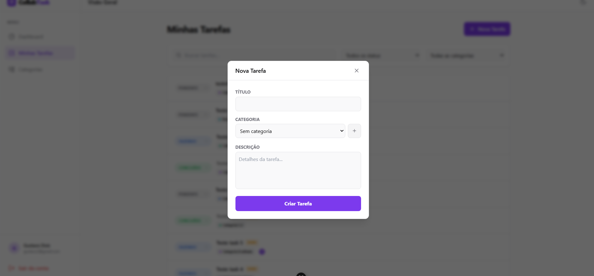
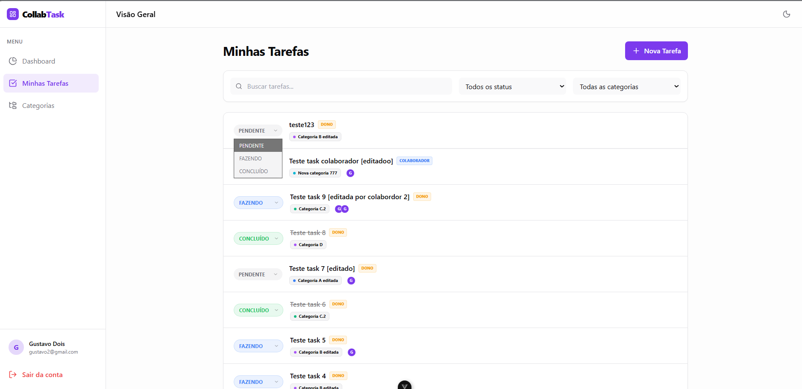
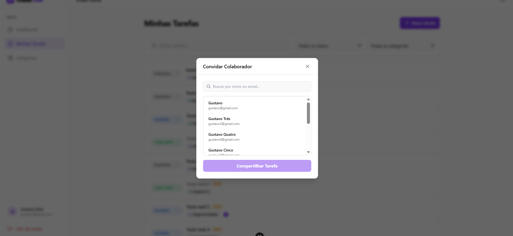
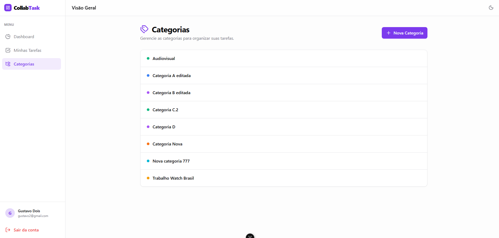

<h1 align="center">📖 Manual do Usuário - Collab Task Manager</h1>

  Bem-vindo(a) ao guia de uso do <b>Collab Task Manager</b>. Este documento mostra de forma prática como navegar pelo sistema e utilizar as principais funções.

---

## 1. Tela Inicial e Acesso

A primeira etapa do sistema é simples e direta, guiando o usuário para a criação da conta ou acesso ao painel.

### Home
Ao abrir o link do projeto, o usuário visualiza uma tela inicial de apresentação e pode escolher entre fazer login ou se cadastrar.

*Página inicial do projeto.*

### Cadastro e Login
Os formulários verificam se as informações estão preenchidas no formato correto (como e-mail e senha) antes de enviar para o servidor, evitando erros desnecessários e respostas demoradas.

*Tela de login e cadastro.*

---

## 2. Dashboard

O Dashboard é a tela de resumo. Ele mostra os gráficos de progresso das tarefas, que podem ser filtrados por períodos (Hoje, Últimos 7 dias, Últimos 30 dias).

### Primeiro Acesso
Se a conta acabou de ser criada, o sistema nota que a lista está vazia e exibe um aviso de boas-vindas, sugerindo um atalho para a criação da primeira tarefa.

*Aviso exibido para contas novas sem tarefas.*

### Gráficos
Quando o usuário já tem tarefas criadas, a tela exibe os totais, a porcentagem de conclusão e um gráfico dividido por categorias. Os dados na tela se atualizam sozinhos de tempos em tempos para manter a visão sempre em dia.

*Painel com o resumo das tarefas.*

---

## 3. Minhas Tarefas

Nesta tela ficam todas as atividades. É possível usar a barra de busca para encontrar algo específico ou usar os filtros rápidos de status e categoria.

### Criando Tarefas e Categorias Juntas
Para não travar o uso, não é necessário sair da tela de tarefas para criar uma categoria nova. O formulário possui um botão integrado que permite criar e já selecionar uma nova categoria ali mesmo.

*Formulário de tarefa com atalho para criar categorias.*

### Mudança de Status
O status das tarefas (Pendente, Fazendo, Concluído) pode ser alterado rapidamente na própria lista através de um menu suspenso, sem precisar abrir a tela de edição.

*Lista de tarefas com identificação de Dono ou Colaborador.*

---

## 4. Compartilhar Tarefas

Qualquer pessoa que criou uma tarefa pode adicionar outros usuários do sistema para visualizá-la e editá-la em conjunto.

### Buscando Usuários
Na hora de convidar alguém, o modal possui um campo de busca que filtra a lista de usuários cadastrados por nome ou e-mail, facilitando a escolha.

*Tela de busca para convidar colaboradores.*

> **Regra de Uso:** Somente o dono da tarefa pode excluí-la ou compartilhá-la. Os colaboradores têm permissão apenas para ler, editar o texto e alterar o status.

---

## 5. Categorias

As categorias servem como "pastas" para organizar as demandas. Na tela de Categorias, o usuário pode visualizar, criar, editar o nome ou apagar as existentes.

### Atalho para Filtro
Para facilitar a navegação, ao clicar em cima de uma categoria na lista, o sistema redireciona o usuário para a tela de Tarefas com o filtro daquela categoria já aplicado.

*Lista de categorias com atalho para as tarefas.*

---

   
  <i>Manual desenvolvido como apoio para experiência do usuário.</i>

